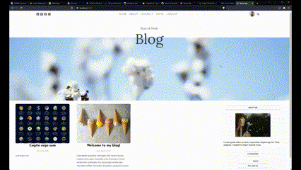

  
  
  
  
  

Full-Stack Software Engineer, I am motivated by the power of technology as a tool for positive change, with a background in hard science, telecommunications engineering and management.

See [my website]() for more information!

<h1 align="center">Projects</h1>
<table bordercolor="#d1345f">
  
  <tr>
    <td width="50%" valign="top">
      <h3 align="center">Punto Tendencia</h3>
         
        
         
        

          
    
  
      

        
<strong>HTML5, CSS3, & Javascript</strong> - Modern and fully responsive site for a local hair salon.

    </td>
    <td width="50%" valign="top">
      <h3 align="center">The Coffee Club</h3>
         
      
         
        

          
     
  
      

        
<strong>HTML5, CSS3, & Javascript</strong> - Fully responsive and minimalist page with JS animations for a trendy coffee shop.

    </td>
  </tr>

  <tr>
    <td width="50%" valign="top">
      <h3 align="center">Cerulean - Vintage wear</h3>
       
        
       
        

     
  
      

        
<strong>React, Styled components, Express, Node & Mongo</strong> - Fullstack e-commerce site for an up and coming vintage fashion store. Unclutered front end with ReactJS, Node backend with Strapi payment integration.

    </td>
    <td width="50%" valign="top">
      <h3 align="center">Personal Blog</h3>
         
        
         
        

          
    
  
      

        
<strong>React, Express, Node & Mongo</strong> - Minimalistic fullstack blog.

    </td>
  </tr>
</table>

<h1 align="center">Technologies</h1>

    
    
    
    
    
    
    <!--  -->
    
    <!--  -->
    <!--  -->
    <!--  -->
    <!--  -->
    <!--  -->
    <!--  -->
    
    
    <!--  -->
    
    
    

---

<h1 align="center">Connect</h1>

  
  
  
  
  

